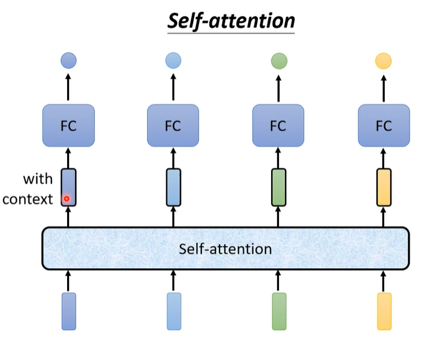

# Deep Learning

> 参考：<https://nndl.github.io/>

## 机器学习基础

表示学习：为了提高机器学习系统的准确率，我们就需要将输入信息转换为有效的特征，或者更一般性地成为表示。如果一种算法可以自动地学习出有效的特征，并提高最终机器学习模型的性能，那么这种学习就可以叫做表示学习。

深度学习是具有多个表示级别的表示学习方法，通过组合简单但非线性的模块获得，每个模块将一个级别的表示（从原始输入开始）转换为更高、更抽象的表示。

神经网络和深度学习不等价。

## 深度学习模型分类

| 网络结构                 | 特点                                                         | 使用场景                                    |
| ------------------------ | ------------------------------------------------------------ | ------------------------------------------- |
| 多层感知机（前馈网络）   | 相邻两层的神经元之间为全连接关系，具有很强的拟合能力，常见的连续非线性函数都可以用前馈网络来近似 | 最简单的网络                                |
| 卷积神经网络（前馈网络） | MLP参数过多，无法提取局部不变性特征；局部连接、权重共享、汇聚 | CV，输入和输出维数固定                      |
| 循环神经网络，LSTM       | 具有短期记忆功能，可以近似任何一个非线性动力系统，但会出现梯度消失/爆炸现象 | 处理时序数据                                |
| 图神经网络               | -                                                            |                                             |
| 自编码器AE，VAE          | 深度生成模型（无监督），f: R^D -> R^M, g: R^M -> R^D，最小化重构错误 | M<D，降维、特征提取；M>=D，稀疏性、取值范围 |
| 深度信念网络DBN          | 深度生成模型，生成符合特定分布的样本；采用逐层预训练和精调   | 学习数据的内部特征表示；降维                |
| GAN                      | 深度生成模型，生成符合数据分布的样本，不显示地估计出数据分布的密度函数；一个判别网络，一个生成网络，对抗训练 | 图像生成                                    |
| 深度强化学习DQN          | -                                                            |                                             |
| 序列生成模型Transformer  | 多头自注意力                                                 | CV，NLP等                                   |

## 学习方式

- 对比学习
- 多模态学习

## 全连接神经网络/多层感知机

输入：一个一维向量，输出：一个一维向量，各个类别的概率。

$$
\boldsymbol{z}^{\left( l \right)}=\boldsymbol{W}^{\left( l \right)}\boldsymbol{a}^{\left( l-1 \right)}+\boldsymbol{b}^{\left( l \right)}
$$


相邻两层的神经元之间为全连接关系，具有很强的拟合能力，常见的连续非线性函数都可以用前馈网络来近似。

## 卷积神经网络

使用全连接神经网络处理图象时，会存在两个问题：

- 参数太多：100×100×3
- 局部不变性：缩放、平移、旋转等不影响语义信息。

输入：C×H×W三维矩阵，最后一层为全连接层，输出类别。

$$
\boldsymbol{z}^{\left( l \right)}=\boldsymbol{W}^{\left( l \right)}\otimes \boldsymbol{a}^{\left( l-1 \right)}+\boldsymbol{b}^{\left( l \right)}
$$

卷积层的性质：

- 局部连接
- 权重共享


汇聚层：卷积层无法缩小H×W，需要进行下采样。

### 卷积运算的实现

> 参考：<https://github.com/dlsyscourse/public_notebooks/blob/main/convolution_implementation.ipynb>

一维卷积作为矩阵乘法：


反向传播使用转置矩阵。

二维卷积的存储方式

- 按行存储
- 按列存储
- tile存储

二维卷积作为矩阵乘法：

1. 迭代卷积核的维数

   ```python
   # 1×1卷积核
   Z = np.random.randn(10,32,32,8)
   W1 = np.random.randn(1,1,8,16)
   out2 = Z @ W1[0,0]
   
   def conv_matrix_mult(Z, weight):
       N,H,W,C_in = Z.shape
       K,_,_,C_out = weight.shape
       out = np.zeros((N,H-K+1,W-K+1,C_out))
       
       for i in range(K):
           for j in range(K):
               out += Z[:,i:i+H-K+1,j:j+W-K+1,:] @ weight[i,j]
       return out
   ```

2. 跨步矩阵乘法：利用tile存储，实现im2col卷积

   ```python
   def conv_im2col(Z, weight):
       N,H,W,C_in = Z.shape
       K,_,_,C_out = weight.shape
       Ns, Hs, Ws, Cs = Z.strides
       
       inner_dim = K * K * C_in
       A = np.lib.stride_tricks.as_strided(Z, shape = (N, H-K+1, W-K+1, K, K, C_in),
                                           strides = (Ns, Hs, Ws, Hs, Ws, Cs)).reshape(-1,inner_dim)
       out = A @ weight.reshape(-1, C_out)
       return out.reshape(N,H-K+1,W-K+1,C_out)
   ```

   > 跨步形式的矩阵和原矩阵共享内存，但是一旦将该矩阵reshape成2D矩阵进行矩阵乘法时，需要申请新的内存空间。更先进的做法是采用“惰性”机制等方法。

### 典型的CNN

- 残差网络：上百层
- 全卷积、空洞卷积

## 生成对抗网络

输入：普通数据分布，输出：数据分布。


网络结构：


Discriminator的目标函数：

$$
 D ^ { * } = a r g \max _ { D } V ( D , G )
$$

$$
V\left( G,D \right) =E_{y\sim P_{data}}\left[ \log D\left( y \right) \right] +E_{y\sim P_G}\left[ \log \left( 1-D\left( y \right) \right) \right]
$$

Generator:

$$
G^*=arg\min_G\max_DV\left( D,G \right)
$$

## Self-attention

考虑了window也不能解决。




Self-attention可以和FC交替使用，堆叠多层。

Self-attention module：


从矩阵乘法的角度看待Self-attention：

$$
q^i=W^qa^i,\left[ q^1,q^2,q^3,q^4 \right] =W^q\left[ a^1,a^2,a^3,a^4 \right]
$$

$$
A=K^TQ
$$

$$
O=VA^,
$$

输入：矩阵（一个词为一个列向量），输入：相同大小的矩阵，$W^q,W^k,W^v$为需要学习的参数。

多头注意力：


### Self-attention Vs. RNN


