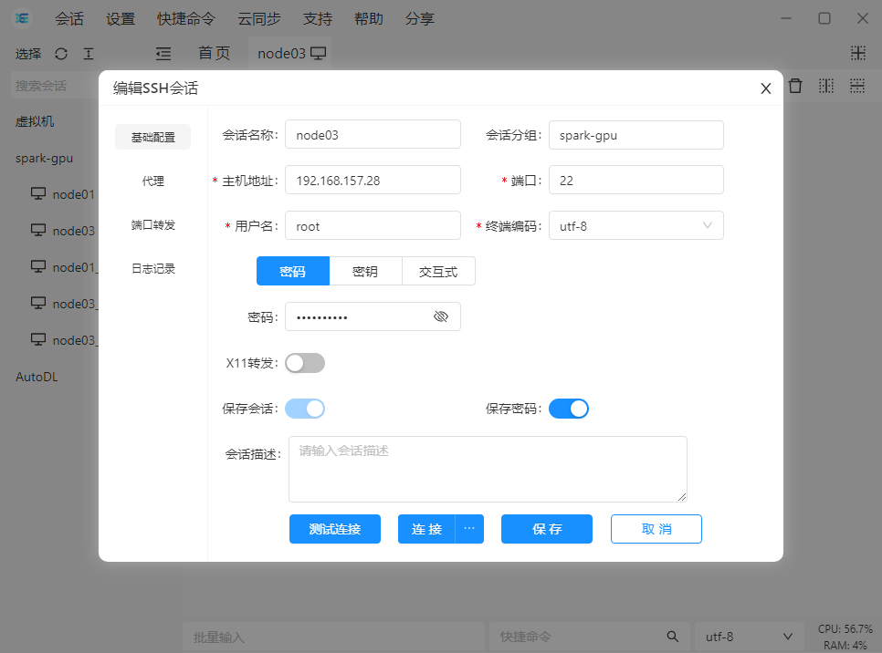
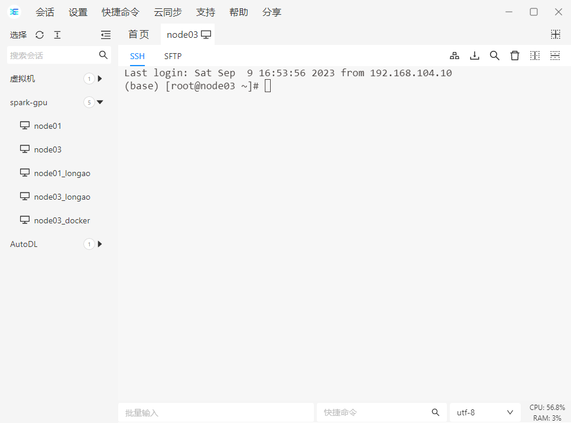
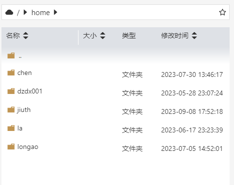
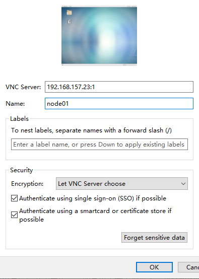

# ssh远程连接及环境准备

## ssh连接服务器

1. 连上交换机。下图为226实验室的交换机，把对应工位上的网线从交换机的前一排插到后排，成功后会弹出认证界面（nap.cug.edu.cn或192.168.167.13），账号：zhangsan；密码：123456。
   
2. 下载ssh工具，闪令或者xshell。
3. 连接一楼的服务器。node03：192.168.157.28，端口：22；用户名：root；密码：siton-2009。下图为登录界面和登录成功后的截图。
   
   

## centos配置

由于当前登录用户为root，操作有风险，玩坏了要重装系统，这里建议新建一个用户，在自己的账户下配置深度学习环境，如果玩坏了，删除用户即可。

创建用户，并添加管理员权限，参考：[centos7中创建用户_centos创建用户_Jepson2017的博客-CSDN博客](https://blog.csdn.net/d1240673769/article/details/102608222?ops_request_misc=%7B%22request%5Fid%22%3A%22168681818316800227432153%22%2C%22scm%22%3A%2220140713.130102334..%22%7D&request_id=168681818316800227432153&biz_id=0&utm_medium=distribute.pc_search_result.none-task-blog-2~all~top_positive~default-1-102608222-null-null.142^v88^control_2,239^v2^insert_chatgpt&utm_term=centos7创建用户&spm=1018.2226.3001.4187)

创建好用户之后，使用创建好的用户登录（一般之后不再使用root），创建好的用户空间在/home目录下，如下图，数据、软件均通过SFTP上传至自己的目录里即可。

## 远程桌面连接

远程桌面root用户已经安装完毕，一般只用于登录浏览器，进行校园网认证。

1. 下载vncviewer。
2. 如下图方式连接即可 192.168.157.28:1，密码：siton-2009。
   
